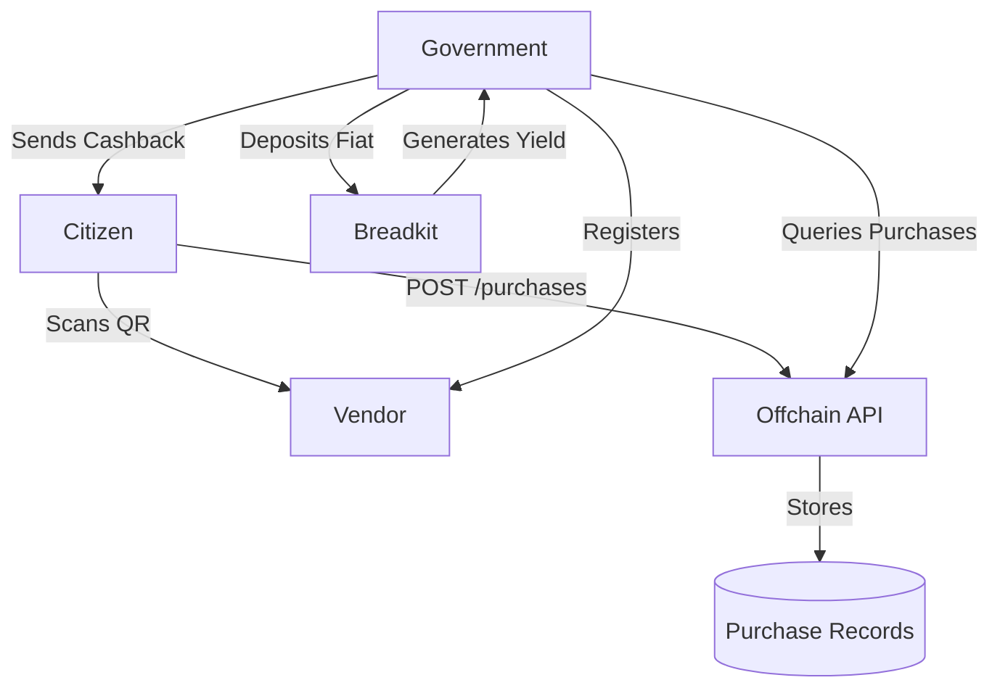
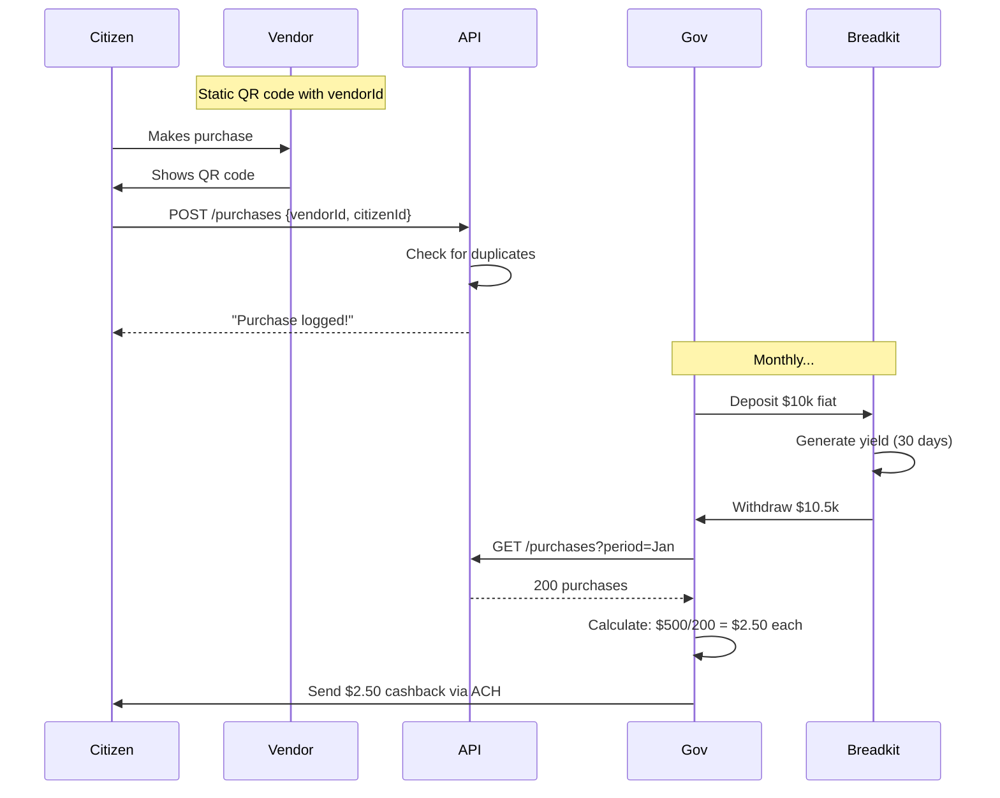
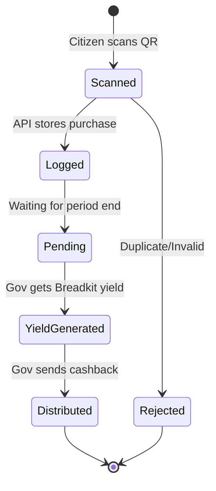

# Technical Spec: Local Commerce Cashback via QR Code Verification

## 1. Background

### Problem Statement

Citizens lack incentives to shop locally, and local vendors have difficulty competing with large retailers. Local governments want to stimulate local commerce but lack simple mechanisms to reward local purchases.

### Context / History

This system provides cashback rewards to citizens who shop at local vendors. Citizens scan QR codes at checkout, purchases are logged offchain, and government periodically deposits fiat into Breadkit to generate yield, then distributes cashback to eligible citizens.

### Stakeholders

- **Citizens**: Shop at local vendors, scan QR codes, receive cashback rewards
- **Vendors**: Local businesses that display QR codes at checkout
- **Local Government**: Funds the program, deposits money into Breadkit, distributes cashback based on purchase data
- **Breadkit**: Generates yield on government deposits, provides on/off-ramp for fiat ↔ crypto

## 2. Motivation

### Goals & Success Stories

**User Story 1 - Citizen**: A citizen purchases groceries at a local vendor, scans the vendor's QR code, and later receives $5 cashback from the government.

**User Story 2 - Vendor**: A local vendor displays a QR code at their register. The government provides them with monthly reports showing how many customers participated.

**User Story 3 - Government**: The government deposits $10,000 into Breadkit monthly, earns yield, uses the yield to fund 5% cashback on local purchases tracked via an offchain API.

**Technical Goals**:
- Simple QR code scanning to log purchases
- Offchain API tracks all purchase records
- Government deposits fiat → Breadkit generates yield → Government withdraws and distributes cashback
- Prevent fraud (duplicate scans, fake vendors)
- No complex smart contracts beyond Breadkit's existing functionality

## 3. Scope and Approaches

### Non-Goals

| Technical Functionality | Reasoning for being off scope |
|------------------------|------------------------------|
| Payment processing | System only logs purchases, doesn't process payments |
| Onchain purchase verification | All purchase data stored offchain via API |
| Automatic real-time cashback | Government distributes periodically after reviewing data |
| Purchase amount tracking | Privacy-focused; only track that purchase happened, not amount |
| Complex smart contracts | Only use Breadkit for yield generation, nothing else onchain |

### Value Proposition

Simple 4-party system: Citizens scan QR codes, API logs it, Government uses Breadkit for yield, distributes cashback.

**The Flow:**
1. Citizen scans vendor QR → API logs purchase
2. Government deposits fiat into Breadkit monthly
3. Breadkit generates yield on deposits
4. Government withdraws yield + principal
5. Government distributes cashback (funded by yield) to citizens via ACH/Venmo/etc

### Relevant Metrics

- **Total purchases logged**: Track program participation
- **Cashback distributed**: Total rewards paid out
- **Yield generated by Breadkit**: ROI on government deposits
- **Fraud rate**: Duplicate scans, fake vendors

## 4. Step-by-Step Flow

### 4.1 Main ("Happy") Path

**Vendor Registration:**

1. Government approves vendor for program
2. Government generates static QR code for vendor (contains: vendorId)
3. Vendor displays QR code at checkout

**Purchase Logging:**

1. Citizen makes purchase at vendor
2. Citizen scans vendor QR code with phone
3. API call: `POST /api/purchases { vendorId, citizenId, timestamp }`
4. API validates:
   - Vendor exists
   - Not duplicate scan (same citizen + vendor within 1 hour)
5. API stores purchase record

**Breadkit Yield Generation:**

1. Government deposits $10,000 fiat into Breadkit (monthly)
2. Breadkit converts to stablecoins, generates yield
3. After period (e.g., 30 days), government withdraws principal + yield
4. Example: Deposited $10k, withdrew $10,500 (5% yield)

**Cashback Distribution:**

1. Government queries API: `GET /api/purchases?period=2025-01`
2. API returns list of eligible purchases (e.g., 200 purchases)
3. Government calculates: $500 yield / 200 purchases = $2.50 per purchase
4. Government sends payments via ACH/Venmo/Zelle to citizens
5. Government marks purchases as paid: `POST /api/purchases/mark-paid`

### 4.2 Alternate / Error Paths

| # | Condition | System Action | Suggested Handling |
|---|-----------|---------------|-------------------|
| A1 | Duplicate scan (same citizen + vendor < 1 hour) | API rejects with 409 Conflict | "Already scanned. Come back on your next visit!" |
| A2 | Vendor not in registry | API rejects with 404 Not Found | "Vendor not participating in program" |
| A3 | Citizen not registered | API rejects with 404 Not Found | "Please register for the program first" |
| A4 | Breadkit yield lower than expected | Government adjusts cashback amount | Distribute available yield proportionally |
| A5 | No purchases in period | No cashback distributed | Government waits for next period |

## 5. UML Diagrams

### System Architecture

**Simple 4-party system:**
- **Citizens** scan vendor QR codes
- **Vendors** display static QR codes
- **API** logs all purchases offchain
- **Government** uses Breadkit for yield, distributes cashback
- **Breadkit** only role: convert fiat → crypto → yield → fiat

### Purchase Flow Sequence

### Cashback Lifecycle

## 6. Edge Cases and Concessions

### Edge Cases

1. **Vendor Collusion**: Vendor lets friends scan without purchasing
   - **Mitigation**: Rate limiting (1 scan/citizen/vendor/hour); government reviews unusual patterns
   - **Concession**: Some abuse possible; pilot can manually review

2. **Sybil Attack**: Single person creates multiple citizen accounts
   - **Mitigation**: Government verifies identity during registration
   - **Simple approach**: Require government ID or SSN

3. **Lost Account Access**: Citizen loses login
   - **Recovery**: Government resets credentials after ID verification

4. **Breadkit Yield Lower Than Expected**: Market conditions reduce yield
   - **Handling**: Distribute whatever yield is available; adjust expectations

5. **No Purchases in Period**: Zero citizens participate
   - **Handling**: Government keeps deposit in Breadkit, rolls over to next period

### Design Decisions

1. **Static QR Codes**: Simpler than dynamic; vendorId only, no signatures/nonces needed
2. **No Purchase Amount Tracking**: Privacy-first; all purchases equal regardless of spend
3. **Offchain Everything**: Only Breadkit interaction is onchain; purchase data stays offchain
4. **Flexible Cashback Math**: Government decides distribution formula (equal split, weighted, caps, etc.)
5. **Simple Duplicate Prevention**: Time-based (1 hour cooldown per vendor)

## 7. Open Questions

1. **How much should government deposit in Breadkit monthly?**
   - Depends on budget, expected participation, target cashback amount
   - Example: $10k deposit → 5% yield → $500 → 100 purchases = $5/purchase

2. **What Breadkit yield rate can we expect?**
   - Varies by market conditions
   - Need realistic projections (3-7% annually?)

3. **Should cashback be equal per purchase or weighted?**
   - Equal: Simple, fair
   - Weighted: Could favor certain vendors (groceries > restaurants)

4. **How to handle citizen registration?**
   - Require SSN/ID verification?
   - Self-service online or in-person at government office?

5. **What payment method for cashback?**
   - ACH (requires bank account)
   - Venmo/Zelle (requires account)
   - Prepaid debit cards (accessible to unbanked)
   - Mix of all three?

6. **How long is cooldown period between scans?**
   - 1 hour? 24 hours? Per vendor or global?

7. **Should there be a cap on purchases per citizen per period?**
   - Prevents one person from dominating the cashback pool
   - E.g., max 10 purchases/month count toward cashback

## 8. Glossary / References

### Terms

- **Citizen**: Program participant who shops at local vendors and receives cashback
- **Vendor**: Local business approved by government, displays QR code at checkout
- **Cashback**: Money distributed to citizens, funded by Breadkit yield
- **QR Code**: Static code containing vendorId only (no cryptography needed)
- **VendorId**: Unique identifier for each vendor
- **Purchase Record**: Simple database entry: {citizenId, vendorId, timestamp, paid: bool}
- **Distribution Period**: Time window (e.g., monthly) for Breadkit yield generation and cashback payout
- **Breadkit**: Yield-generating protocol used by government to grow deposits

### System Components

**Offchain API**:
- `POST /api/purchases` - Log citizen purchase
- `GET /api/purchases?period=2025-01` - Export purchases for period
- `POST /api/purchases/mark-paid` - Mark purchases as distributed
- `POST /api/vendors` - Register new vendor
- `POST /api/citizens` - Register new citizen

**Breadkit Integration**:
- Government deposits fiat (via bank transfer or onramp)
- Breadkit converts to stablecoins, generates yield
- Government withdraws principal + yield after period
- That's it - no custom smart contracts needed

### Similar Systems

- Credit card cashback programs (but government-funded)
- Farmers market voucher programs (but with crypto yield funding)
- Local currency programs (but using USD/stablecoins)
