# 技術仕様書:気仙沼クルーシップモバイルアプリケーション

## 1. 背景

### 問題提起
地域観光経済は、訪問者や住民を有意義な文化的・商業的交流に巻き込むことに課題を抱えています。気仙沼市は以下を実現するための統一されたデジタルプラットフォームを必要としています:
- 地元企業や文化施設への訪問者のエンゲージメントを高める
- コミュニティの参加を追跡し報酬を提供する
- 地域のイベントや観光イニシアチブを促進する
- ふるさと納税を促進する
- 訪問者や潜在的な移住者との長期的な関係を構築する

### 背景/経緯
- 現在のシステム:SYMONS SYSTEMによって運営
- 管理者:一般社団法人気仙沼地域戦略
- 既存のインフラには地元商店のPOS統合が含まれる
- 過去のキャンペーンにはスタンプラリーや季節のプロモーションイベントが含まれる
- 全国のふるさと納税システムとの統合

### ステークホルダー
- **主要ユーザー**:観光客、地元住民、潜在的な移住者
- **ビジネスユーザー**:地元商店、飲食店、宿泊施設提供者
- **管理者**:気仙沼市役所、地域戦略協会
- **外部システム**:
  - SYMONS決済/ポイントシステム
  - 全国ふるさと納税プラットフォーム
  - 地元交通事業者(JR、バス会社)
  - サードパーティコンテンツプロバイダー(ニュース、ラジオ)

## 2. 動機

### 目標とサクセスストーリー

**ユーザー目標1:観光客のエンゲージメント**
- **ストーリー**:訪問者が気仙沼に到着し、アプリをダウンロードし、スタンプラリーに参加し、レストランや店舗でポイントを集め、厳選されたコンテンツを通じて地域文化を学ぶ
- **成功指標**:アプリユーザーの70%が少なくとも1つのスタンプラリーに参加、ユーザーあたり平均5回以上の店舗訪問

**ユーザー目標2:ロイヤルティと定着**
- **ストーリー**:リピート訪問者が蓄積されたクルーポイントを割引に使用し、パーソナライズされたおすすめを受け取り、通知を通じて繋がりを維持する
- **成功指標**:月間アクティブユーザー定着率40%、ユーザーの30%が年間3回以上訪問

**ユーザー目標3:コミュニティとの繋がり**
- **ストーリー**:潜在的な移住者がアプリを使って気仙沼の文化を探索し、イベントに参加し、移住オフィス(MINATO)と繋がり、最終的に移住する
- **成功指標**:アプリユーザーから移住相談依頼への転換率15%

**技術目標1:統一商取引プラットフォーム**
- ポイント、チケット、クーポン、ふるさと納税を単一のデジタルウォレットに統合
- シームレスな取引のための商店POSシステムのサポート
- ピアツーピアのチケット贈与を可能にする

**技術目標2:コンテンツ発見**
- 地元のニュース、イベント、文化情報を集約
- 位置情報に基づくレコメンデーションを提供
- 多言語コンテンツ配信のサポート

**技術目標3:キャンペーン管理**
- 柔軟なスタンプラリー作成と管理
- キャンペーンパフォーマンスのための分析ダッシュボード
- 自動報酬配布

## 3. スコープとアプローチ

### スコープ内の機能
- ユーザー登録と認証
- デジタルウォレット(ポイント、チケット、クーポン)
- QRコード生成とスキャン
- スタンプラリー参加と追跡
- ニュース/記事のコンテンツ管理システム
- 位置情報サービスとレコメンデーション
- ふるさと納税統合
- 商店ディレクトリと検索
- プッシュ通知
- 多言語サポート(日本語主、英語副)

### 非目標

| 技術機能 | スコープ外の理由 | トレードオフ |
|---------|----------------|------------|
| **ネイティブ決済処理** | 既存のSYMONS決済インフラと統合 | サードパーティへの依存、決済UXのカスタマイズ制限 |
| **リアルタイムチャット/メッセージング** | MVPのコアではない、コンテンツ消費と商取引に焦点 | ユーザーが質問したい場合がある、外部問い合わせフォームを使用可能 |
| **拡張現実機能** | 開発コストが高い、v1のROIが限定的 | 観光客体験を向上させる可能性、v2に延期 |
| **オフラインモード** | 複雑な同期ロジックが必要、エリアは十分なモバイルカバレッジ | 遠隔沿岸エリアでの使用性に影響の可能性 |
| **ソーシャルメディア統合** | プライバシーの懸念、追加のAPIメンテナンス | バイラル共有の可能性が低下 |
| **Apple Pay / Google Pay** | SYMONSシステムがサポートしていない、商店POSの制限 | デジタルウォレットを持つユーザーにとって不便 |
| **多都市展開** | 気仙沼特化のブランディングとパートナーシップ | スケーラビリティの制限、将来の展開のためのリファクタリングが必要 |
| **高度な分析(ユーザー向け)** | 実装が複雑、ユーザー需要が不明確 | パワーユーザーが個人のインサイトを求める可能性 |
| **ブロックチェーン/Web3機能** | 不要な複雑性、明確なユースケースなし | トレンディだが技術的負債を追加 |
| **ビデオコンテンツストリーミング** | 高い帯域幅/ストレージコスト、インフラが限定的 | リッチメディアが文化コンテンツを強化する可能性 |

### 技術的負債と既知の制限
- **レート制限**:現在のAPIエンドポイントにはレート制限がない、当初は低ボリュームの使用を想定しているが、急激なトラフィックスパイク(祭りの日など)がパフォーマンスに影響する可能性
- **データ同期**:ポイント/チケット残高は非同期で更新、取引後5-10秒間古いデータが表示される可能性
- **QRコードセキュリティ**:暗号化なしの基本的なQRコード、スクリーンショット共有に脆弱(低価値チケットには許容可能)
- **検索パフォーマンス**:記事/商店の全文検索は大規模データセット(10,000レコード以上)でパフォーマンスが低下する可能性
- **通知配信**:FCM/APNSに依存、配信失敗のフォールバックなし
- **アクセシビリティ**:WCAG準拠が完全に実装されていない、スクリーンリーダーサポートが限定的

## 4. システムアーキテクチャ

### 高レベルアーキテクチャ
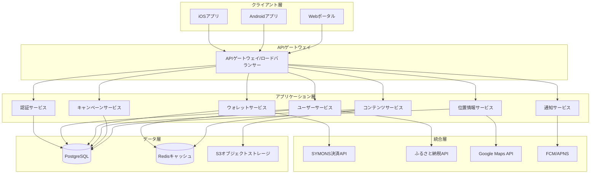

### データモデル
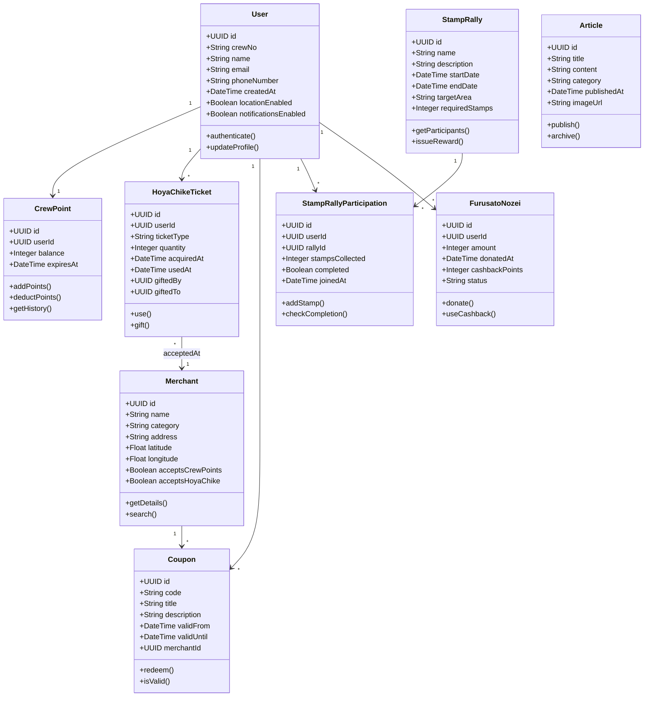

## 5. UML図

### ユーザー認証フロー
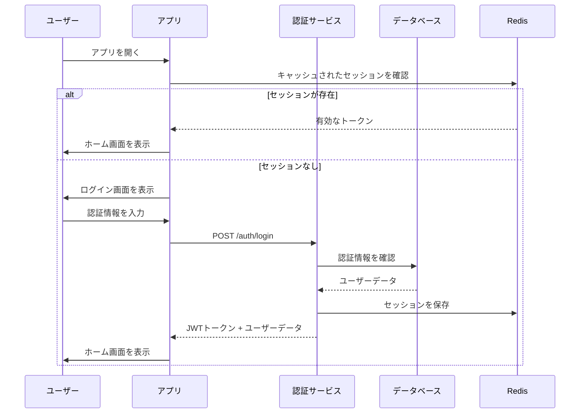

### チケット贈与フロー
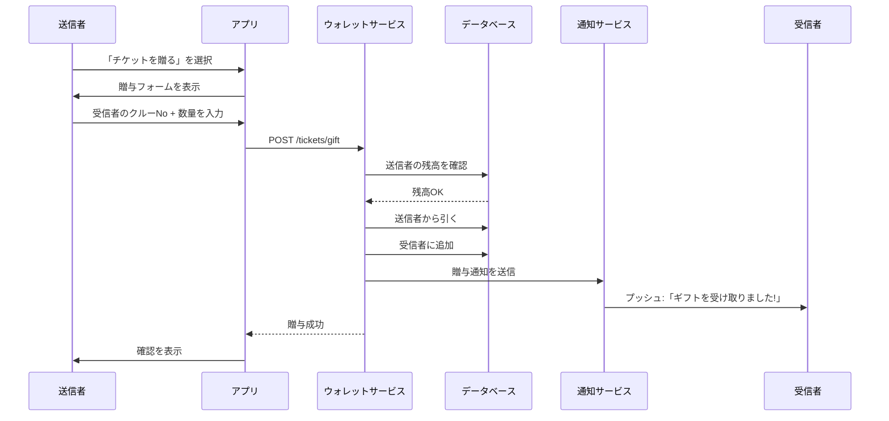

### スタンプラリー参加
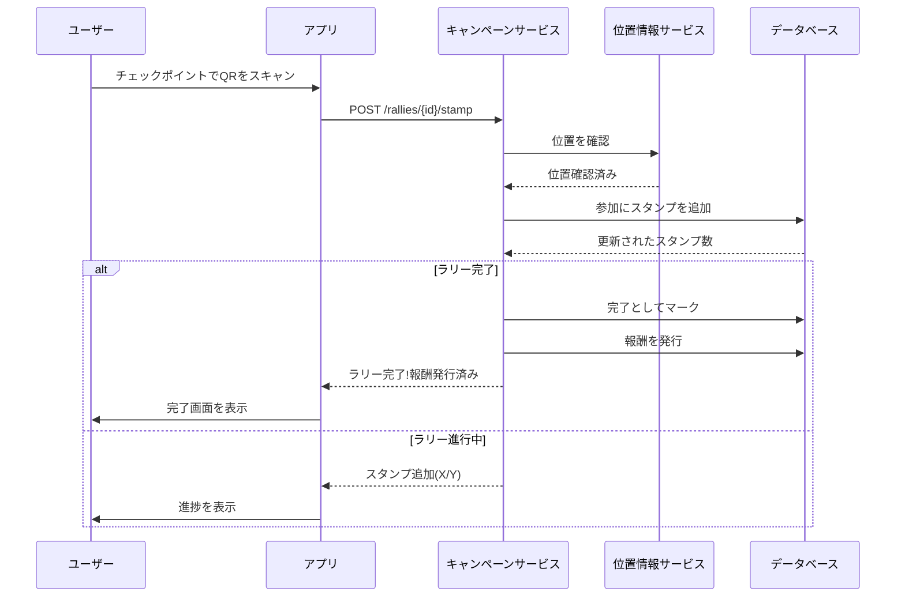

### ポイント取引状態機械
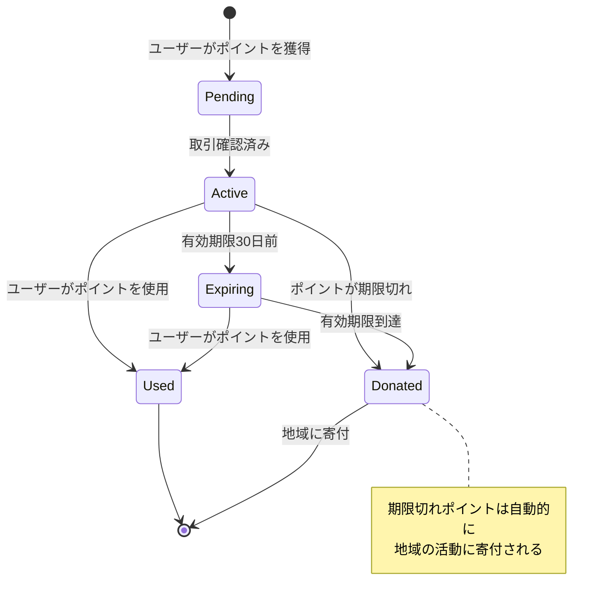

### クーポンライフサイクル
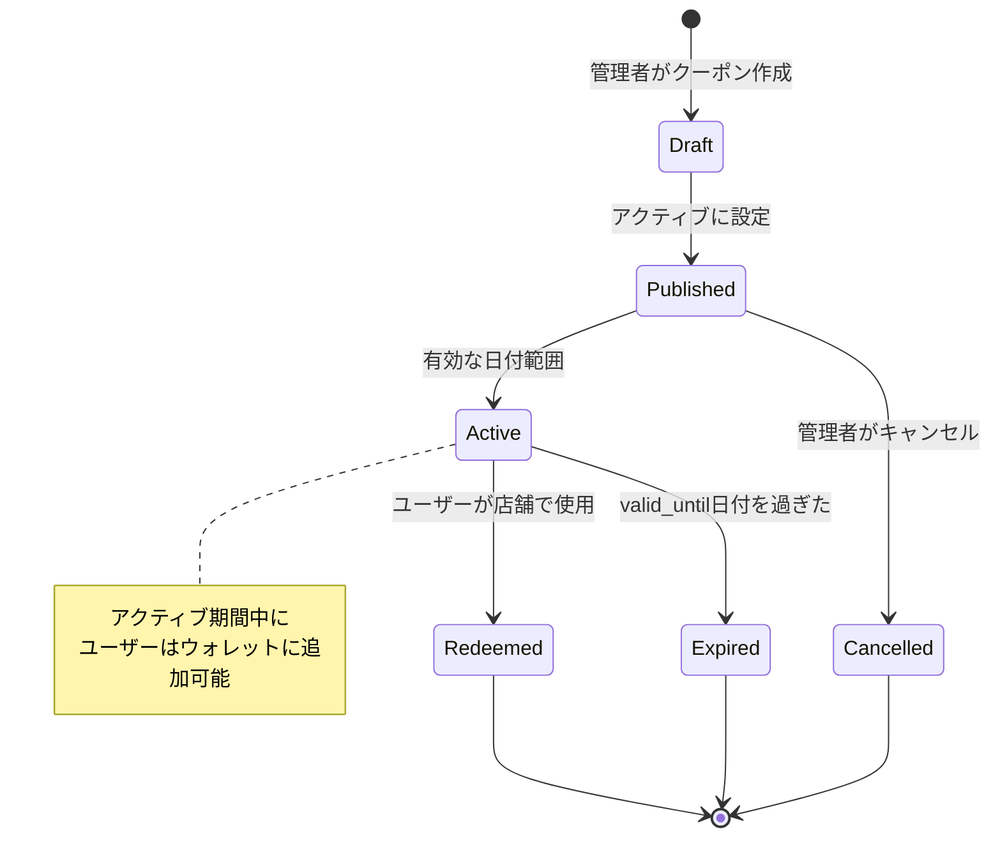

### コンテンツ発見フロー
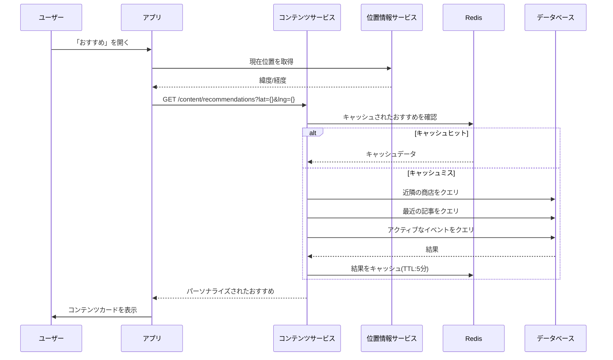

### ふるさと納税統合
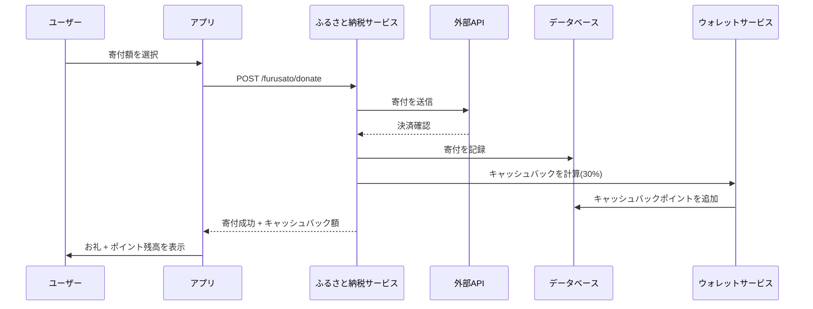

## 6. APIエンドポイント

### 認証
- `POST /api/v1/auth/register` - 新規ユーザー登録
- `POST /api/v1/auth/login` - ユーザーログイン
- `POST /api/v1/auth/logout` - ユーザーログアウト
- `POST /api/v1/auth/refresh` - JWTトークン更新
- `POST /api/v1/auth/forgot-password` - パスワードリセットリクエスト

### ユーザープロフィール
- `GET /api/v1/users/me` - 現在のユーザープロフィールを取得
- `PUT /api/v1/users/me` - ユーザープロフィールを更新
- `GET /api/v1/users/me/qr` - ユーザーQRコードを生成
- `PATCH /api/v1/users/me/settings` - アプリ設定を更新

### ウォレットとポイント
- `GET /api/v1/wallet/points` - ポイント残高を取得
- `GET /api/v1/wallet/points/history` - ポイント取引履歴を取得
- `POST /api/v1/wallet/points/redeem` - 商店でポイントを使用

### ほやチケ
- `GET /api/v1/tickets` - ユーザーのチケットを取得
- `POST /api/v1/tickets/acquire` - 新しいチケットを取得
- `POST /api/v1/tickets/{id}/use` - チケットを使用
- `POST /api/v1/tickets/{id}/gift` - 他のユーザーにチケットを贈る
- `GET /api/v1/tickets/history` - チケット取引履歴を取得
- `GET /api/v1/tickets/merchants` - 受け入れる商店を取得

### クーポン
- `GET /api/v1/coupons` - ユーザーのクーポンを取得
- `POST /api/v1/coupons/add` - コードでクーポンを追加
- `POST /api/v1/coupons/scan` - QRスキャンでクーポンを追加
- `POST /api/v1/coupons/{id}/redeem` - クーポンを使用
- `GET /api/v1/coupons/available` - 利用可能なクーポンを閲覧

### スタンプラリー
- `GET /api/v1/rallies` - アクティブなラリーをリスト
- `GET /api/v1/rallies/{id}` - ラリー詳細を取得
- `POST /api/v1/rallies/{id}/join` - ラリーに参加
- `POST /api/v1/rallies/{id}/stamp` - スタンプを追加(QRスキャン)
- `GET /api/v1/rallies/my-participation` - ユーザーのラリー進捗を取得

### 商店と場所
- `GET /api/v1/merchants` - 商店を検索(フィルター付き)
- `GET /api/v1/merchants/{id}` - 商店詳細を取得
- `GET /api/v1/merchants/nearby` - 近隣の商店を取得(地理クエリ)
- `GET /api/v1/locations/recommendations` - パーソナライズされたおすすめを取得

### コンテンツ
- `GET /api/v1/articles` - 記事をリスト(ページネーション)
- `GET /api/v1/articles/{id}` - 記事詳細を取得
- `GET /api/v1/announcements` - お知らせを取得
- `GET /api/v1/events` - 今後のイベントをリスト

### ふるさと納税
- `POST /api/v1/furusato/donate` - 寄付を行う
- `GET /api/v1/furusato/history` - 寄付履歴を取得
- `GET /api/v1/furusato/cashback` - キャッシュバック残高を取得
- `POST /api/v1/furusato/cashback/use` - キャッシュバックポイントを使用
- `GET /api/v1/furusato/merchants` - 参加商店を取得

### 交通
- `GET /api/v1/transportation/jr-schedule` - JR列車時刻
- `GET /api/v1/transportation/bus-schedule` - バス時刻
- `GET /api/v1/transportation/taxi` - タクシー連絡先情報
- `GET /api/v1/transportation/rental-car` - レンタカー情報
- `GET /api/v1/transportation/rental-cycle` - 自転車レンタル情報

### 通知
- `GET /api/v1/notifications` - ユーザー通知を取得
- `PATCH /api/v1/notifications/{id}/read` - 既読としてマーク
- `POST /api/v1/notifications/register-device` - プッシュトークンを登録

## 7. 技術スタック

### モバイルアプリケーション
- **iOS**:Swift 5.9+ / SwiftUI、iOS 15.0+
- **Android**:Kotlin 1.9+ / Jetpack Compose、Android 8.0+ (API 26+)
- **クロスプラットフォーム代替**:React Native 0.72+(予算が限られている場合)

### バックエンド
- **ランタイム**:Node.js 20 LTS / TypeScript 5.2+
- **フレームワーク**:NestJS 10+(モジュラーアーキテクチャ)
- **API**:RESTful + GraphQL(将来の検討事項)
- **認証**:リフレッシュトークン付きJWT

### データベース
- **プライマリ**:PostgreSQL 15+(ユーザーデータ、取引、コンテンツ)
- **キャッシュ**:Redis 7+(セッション、頻繁にアクセスされるデータ)
- **検索**:Elasticsearch 8+(商店/記事検索) - オプション
- **オブジェクトストレージ**:AWS S3 / CloudFlare R2(画像、メディア)

### インフラストラクチャ
- **ホスティング**:AWS / Google Cloud Platform
- **CDN**:CloudFlare(静的アセット、APIキャッシング)
- **モニタリング**:Datadog / New Relic
- **エラー追跡**:Sentry
- **CI/CD**:GitHub Actions / GitLab CI

### サードパーティサービス
- **マップ**:Google Maps API
- **プッシュ通知**:Firebase Cloud Messaging (FCM) + Apple Push Notification Service (APNS)
- **分析**:Google Analytics 4 + Mixpanel
- **決済**:SYMONS System API統合
- **メール**:SendGrid / AWS SES

# 暗号通貨APYを使用してキャッシュバック報酬を持続的に創出する

# 技術仕様書:QRコード検証による地域商取引キャッシュバック

## 1. 背景

### 問題提起

市民は地元で買い物をするインセンティブが不足しており、地元販売者は大手小売店との競争に困難を抱えています。地方自治体は地域商取引を活性化したいが、地元での購入に報酬を与える簡単なメカニズムがありません。

### 背景/経緯

このシステムは、地元販売者で買い物をした市民にキャッシュバック報酬を提供します。市民はチェックアウト時にQRコードをスキャンし、購入がオフチェーンで記録され、自治体は定期的にBreadkitに法定通貨を預け入れて利回りを生成し、その後適格な市民にキャッシュバックを配布します。

### ステークホルダー

- **市民**:地元販売者で買い物をし、QRコードをスキャンし、キャッシュバック報酬を受け取る
- **販売者**:チェックアウト時にQRコードを表示する地元企業
- **地方自治体**:プログラムに資金を提供し、Breadkitに資金を預け入れ、購入データに基づいてキャッシュバックを配布する
- **Breadkit**:自治体の預金で利回りを生成し、法定通貨↔暗号通貨のオン/オフランプを提供する

## 2. 動機

### 目標とサクセスストーリー

**ユーザーストーリー1 - 市民**:市民が地元販売者で食料品を購入し、販売者のQRコードをスキャンし、後に自治体から5ドルのキャッシュバックを受け取る。

**ユーザーストーリー2 - 販売者**:地元販売者がレジにQRコードを表示する。自治体は参加した顧客数を示す月次レポートを提供する。

**ユーザーストーリー3 - 自治体**:自治体は月次でBreadkitに10,000ドルを預け入れ、利回りを得て、オフチェーンAPIで追跡された地元での購入に対して5%のキャッシュバックを資金提供するために利回りを使用する。

**技術目標**:
- 購入を記録するためのシンプルなQRコードスキャン
- オフチェーンAPIがすべての購入記録を追跡
- 自治体が法定通貨を預け入れ → Breadkitが利回りを生成 → 自治体が引き出してキャッシュバックを配布
- 詐欺を防ぐ(重複スキャン、偽の販売者)
- Breadkitの既存機能以外の複雑なスマートコントラクトなし

## 3. スコープとアプローチ

### 非目標

| 技術機能 | スコープ外の理由 |
|---------|----------------|
| 決済処理 | システムは購入を記録するのみ、決済は処理しない |
| オンチェーン購入検証 | すべての購入データはAPIを通じてオフチェーンで保存 |
| 自動リアルタイムキャッシュバック | 自治体はデータをレビューした後に定期的に配布 |
| 購入金額追跡 | プライバシー重視、購入が発生したことのみを追跡、金額は追跡しない |
| 複雑なスマートコントラクト | 利回り生成にのみBreadkitを使用、他のオンチェーン処理なし |

### 価値提案

シンプルな4者システム:市民がQRコードをスキャン、APIが記録、自治体がBreadkitを利回りに使用、キャッシュバックを配布。

**フロー:**
1. 市民が販売者QRをスキャン → APIが購入を記録
2. 自治体が月次でBreadkitに法定通貨を預け入れ
3. Breadkitが預金で利回りを生成
4. 自治体が利回り + 元本を引き出し
5. 自治体が(利回りで資金提供された)キャッシュバックをACH/Venmoなどで市民に配布

### 関連指標

- **記録された購入総数**:プログラム参加を追跡
- **配布されたキャッシュバック**:支払われた報酬の合計
- **Breadkitで生成された利回り**:自治体預金のROI
- **詐欺率**:重複スキャン、偽の販売者

## 4. ステップバイステップフロー

### 4.1 メイン(「ハッピー」)パス

**販売者登録:**

1. 自治体がプログラムへの販売者を承認
2. 自治体が販売者の静的QRコードを生成(含まれる内容:vendorId)
3. 販売者がチェックアウト時にQRコードを表示

**購入記録:**

1. 市民が販売者で購入
2. 市民が携帯電話で販売者QRコードをスキャン
3. API呼び出し:`POST /api/purchases { vendorId, citizenId, timestamp }`
4. APIが検証:
   - 販売者が存在するか
   - 重複スキャンでないか(同じ市民 + 販売者で1時間以内)
5. APIが購入記録を保存

**Breadkit利回り生成:**

1. 自治体がBreadkitに10,000ドルの法定通貨を預け入れ(月次)
2. Breadkitがステーブルコインに変換し、利回りを生成
3. 期間(例:30日)後、自治体が元本 + 利回りを引き出し
4. 例:10,000ドル預け入れ、10,500ドル引き出し(5%利回り)

**キャッシュバック配布:**

1. 自治体がAPIにクエリ:`GET /api/purchases?period=2025-01`
2. APIが適格な購入のリストを返す(例:200件の購入)
3. 自治体が計算:500ドルの利回り / 200件の購入 = 購入あたり2.50ドル
4. 自治体がACH/Venmo/Zelleで市民に支払いを送信
5. 自治体が購入を支払い済みとしてマーク:`POST /api/purchases/mark-paid`

### 4.2 代替/エラーパス

| # | 条件 | システムアクション | 推奨される処理 |
|---|------|------------------|---------------|
| A1 | 重複スキャン(同じ市民 + 販売者 < 1時間) | APIが409 Conflictで拒否 | 「既にスキャン済みです。次回訪問時にお越しください!」 |
| A2 | 販売者が登録にない | APIが404 Not Foundで拒否 | 「販売者はプログラムに参加していません」 |
| A3 | 市民が登録されていない | APIが404 Not Foundで拒否 | 「まずプログラムにご登録ください」 |
| A4 | Breadkit利回りが予想より低い | 自治体がキャッシュバック額を調整 | 利用可能な利回りを比例配分 |
| A5 | 期間中の購入なし | キャッシュバック配布なし | 自治体が次の期間を待つ |

## 5. UML図

### システムアーキテクチャ

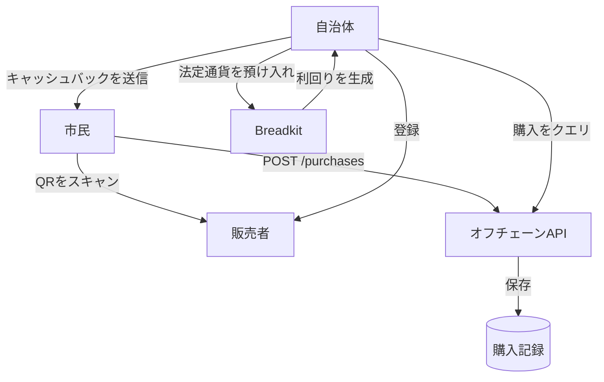

**シンプルな4者システム:**
- **市民**が販売者QRコードをスキャン
- **販売者**が静的QRコードを表示
- **API**がすべての購入をオフチェーンで記録
- **自治体**がBreadkitを利回りに使用、キャッシュバックを配布
- **Breadkit**の唯一の役割:法定通貨 → 暗号通貨 → 利回り → 法定通貨への変換

### 購入フローシーケンス

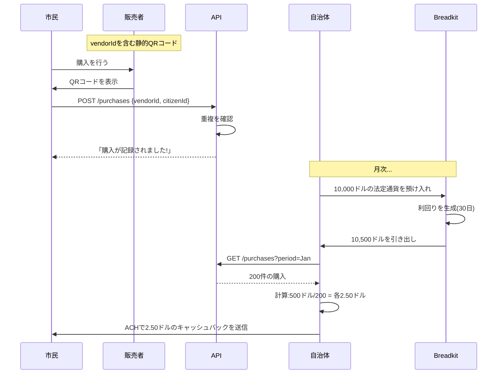

### キャッシュバックライフサイクル

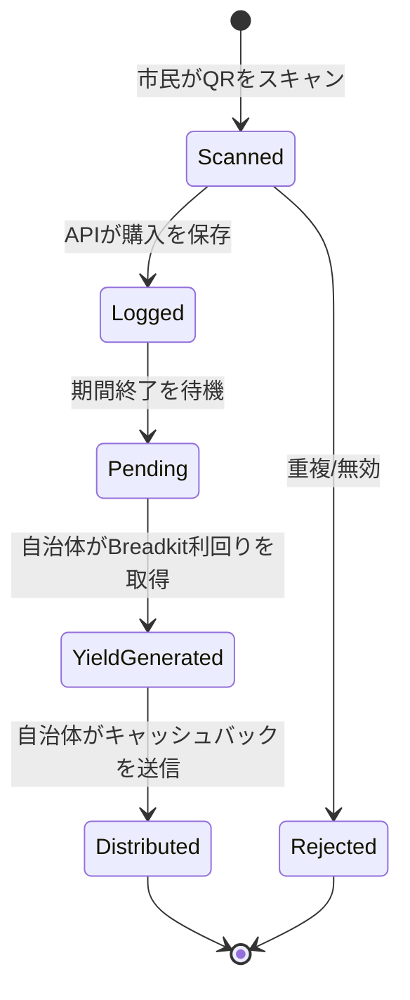

## 6. エッジケースと妥協点

### エッジケース

1. **販売者の共謀**:販売者が購入なしで友人にスキャンさせる
   - **緩和策**:レート制限(1スキャン/市民/販売者/時間)、自治体が異常なパターンをレビュー
   - **妥協点**:一部の悪用は可能、パイロットは手動でレビュー可能

2. **シビル攻撃**:1人が複数の市民アカウントを作成
   - **緩和策**:自治体が登録時に身元を確認
   - **シンプルなアプローチ**:政府ID またはSSNを要求

3. **アカウントアクセスの喪失**:市民がログインを失う
   - **回復**:自治体がID確認後に認証情報をリセット

4. **Breadkit利回りが予想より低い**:市場状況が利回りを低下させる
   - **処理**:利用可能な利回りを配布、期待値を調整

5. **期間中の購入なし**:参加する市民がゼロ
   - **処理**:自治体がBreadkitに預金を保持、次の期間に繰り越し

### 設計決定

1. **静的QRコード**:動的よりシンプル、vendorIdのみ、署名/ノンスは不要
2. **購入金額追跡なし**:プライバシー第一、支出に関係なくすべての購入が平等
3. **すべてオフチェーン**:Breadkitとのやり取りのみがオンチェーン、購入データはオフチェーンのまま
4. **柔軟なキャッシュバック計算**:自治体が配布式を決定(均等分割、加重、上限など)
5. **シンプルな重複防止**:時間ベース(販売者ごとに1時間のクールダウン)

## 7. 未解決の質問

1. **自治体は月次でBreadkitにいくら預け入れるべきか?**
   - 予算、予想される参加、目標キャッシュバック額による
   - 例:10,000ドル預金 → 5%利回り → 500ドル → 100件の購入 = 購入あたり5ドル

2. **Breadkitの利回り率はどの程度を期待できるか?**
   - 市場状況により変動
   - 現実的な予測が必要(年間3-7%?)

3. **キャッシュバックは購入あたり均等であるべきか、加重すべきか?**
   - 均等:シンプル、公平
   - 加重:特定の販売者を優遇できる(食料品 > レストラン)

4. **市民登録をどのように処理するか?**
   - SSN/ID確認を要求?
   - オンラインまたは自治体オフィスでの対面によるセルフサービス?

5. **キャッシュバックの支払い方法は?**
   - ACH(銀行口座が必要)
   - Venmo/Zelle(アカウントが必要)
   - プリペイドデビットカード(銀行口座を持たない人にアクセス可能)
   - 3つすべての混合?

6. **スキャン間のクールダウン期間はどのくらいか?**
   - 1時間? 24時間? 販売者ごとまたはグローバル?

7. **期間あたりの市民あたりの購入に上限を設けるべきか?**
   - 1人がキャッシュバックプールを独占するのを防ぐ
   - 例:月に最大10件の購入がキャッシュバックにカウント

## 8. 用語集/参考資料

### 用語

- **市民**:地元販売者で買い物をしてキャッシュバックを受け取るプログラム参加者
- **販売者**:自治体に承認された地元企業、チェックアウト時にQRコードを表示
- **キャッシュバック**:Breadkit利回りで資金提供され、市民に配布される資金
- **QRコード**:vendorIdのみを含む静的コード(暗号化不要)
- **VendorId**:各販売者の一意の識別子
- **購入記録**:シンプルなデータベースエントリ:{citizenId, vendorId, timestamp, paid: bool}
- **配布期間**:Breadkit利回り生成とキャッシュバック支払いの時間枠(例:月次)
- **Breadkit**:自治体が預金を増やすために使用する利回り生成プロトコル

### システムコンポーネント

**オフチェーンAPI**:
- `POST /api/purchases` - 市民の購入を記録
- `GET /api/purchases?period=2025-01` - 期間の購入をエクスポート
- `POST /api/purchases/mark-paid` - 購入を配布済みとしてマーク
- `POST /api/vendors` - 新しい販売者を登録
- `POST /api/citizens` - 新しい市民を登録

**Breadkit統合**:
- 自治体が法定通貨を預け入れ(銀行振込またはオンランプ経由)
- Breadkitがステーブルコインに変換し、利回りを生成
- 自治体が期間後に元本 + 利回りを引き出し
- それだけ - カスタムスマートコントラクトは不要

### 類似システム

- クレジットカードキャッシュバックプログラム(ただし自治体資金)
- ファーマーズマーケットバウチャープログラム(ただし暗号利回り資金)
- 地域通貨プログラム(ただしUSD/ステーブルコインを使用)
